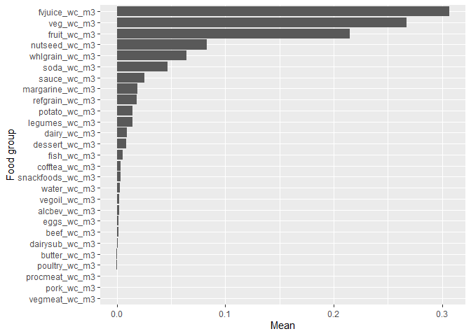
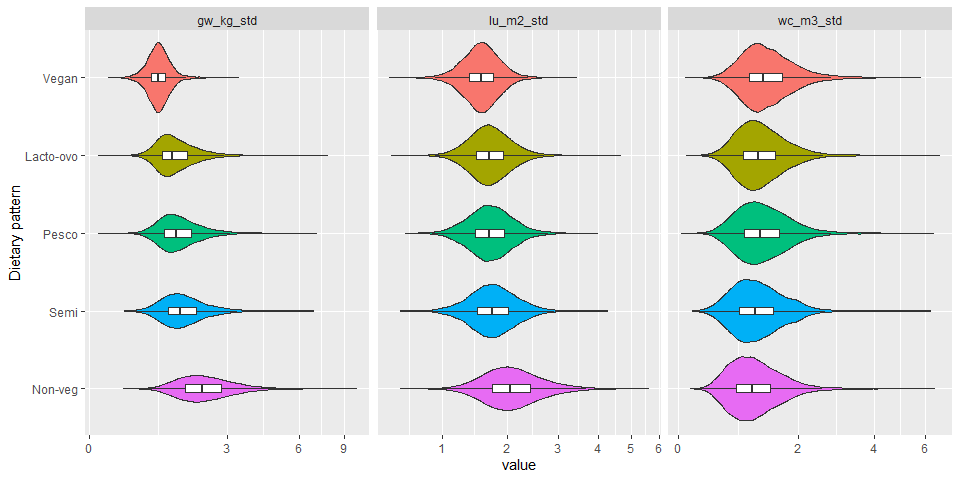
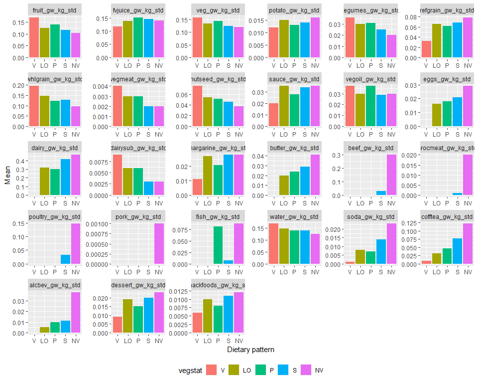

AHS-2 Environmental Nutrition
================

## Dataset

-   File path:
    `M:\Groups\Nutrition\Environmental Nutrition\AHS-2 Environment and Health`

-   File Name: `baseline-environmental-data-per-subject-20210824.csv`

-   Includes *n* = 88008 subjects and

-   187 variables:

    -   Demographics:
        -   Age at baseline: `agein`
        -   BMI: `bmi`
        -   Education, 3 levels: `edu3cat`
        -   Gender: `female`
        -   Race (Black/Non-Black): `black`
    -   Total intake in kcal, gram and servings per day
    -   28 food groups in:
        -   kcal/day: `*_kcal`
        -   gram/day: `*_gram`
        -   standard servings/day: `*_srv`
        -   GWP (kg CO2-eq): `*_gw_kg`
        -   land use (m²a): `*_lu_m2`
        -   water consumption (m³): `*_wc_m3`
        -   (replace \* with food group name – see below)

-   There are 28 food groups:

<!-- -->

    ##  [1] "fruit"      "fvjuice"    "veg"        "potato"     "legumes"   
    ##  [6] "refgrain"   "whlgrain"   "vegmeat"    "nutseed"    "sauce"     
    ## [11] "vegoil"     "eggs"       "dairy"      "dairysub"   "margarine" 
    ## [16] "butter"     "beef"       "procmeat"   "poultry"    "pork"      
    ## [21] "fish"       "water"      "soda"       "cofftea"    "alcbev"    
    ## [26] "dessert"    "snackfoods"

### Issues

-   Environmental variables of cereal (`cereal_gw_kg`, `cereal_lu_m2`,
    `cereal_wc_m3`) have all zero values. AM has been notified.

### Changes

-   More subjects (+12,000) included.
-   Dietary pattern (5 groups) added.
-   `pork` and `beef` intakes are now separated.
-   All food group variables (`*_kcal`, `*_gram`, `*_srv`, `*_gw_kg`,
    `*_lu_m2`, `*_wc_m3`) were winsorized at the 99.9th percentile of
    each variable. Total `kcal`, `gram`, `srv`, `gw_kg`, `lu_m2`, and
    `wc_m3` were recalculated by summing across 28 food groups after
    winsorization.

## Demographics

    ##                    
    ##                     level          Overall      
    ##   n                                88008        
    ##   agein (mean (SD))                58.32 (14.31)
    ##   bmi (mean (SD))                  27.11 (5.84) 
    ##   edu3cat (%)       Highschool     18627 (21.4) 
    ##                     Some College   34350 (39.5) 
    ##                     College Degree 33914 (39.0) 
    ##   female (%)        Male           30921 (35.1) 
    ##                     Female         57057 (64.9) 
    ##   black (%)         Non-Black      65354 (74.7) 
    ##                     Black          22175 (25.3) 
    ##   vegstat (%)       Vegan           7351 ( 8.4) 
    ##                     Lacto-ovo      26412 (30.0) 
    ##                     Semi            4772 ( 5.4) 
    ##                     Pesco           8655 ( 9.8) 
    ##                     Non-veg        40817 (46.4)

## Total food intake

-   Distributions of total intake in kcal, gram and servings per day
    -   It appears that those with kcal &lt;500 or &gt;4500 are already
        excluded.
    -   The max gram intake became more reasonable after winsorizing
        data.

<!-- -->

    ##         min      Q1  median      Q3     max    mean      sd skew
    ## kcal 140.75 1195.34 1591.82 2089.16 4440.27 1697.58  690.42 0.80
    ## gram  88.99 2147.52 2754.31 3434.03 9762.23 2838.34 1029.28 0.62
    ## srv    1.48   30.38   39.05   49.21  127.34   40.65   14.58 0.65

## Total environmental impact

-   Distributions of total GWP, land use and water consumption are
    right-skewed:

<!-- -->

    ##        min   Q1 median   Q3   max mean   sd skew
    ## gw_kg 0.01 0.97   1.38 2.00 10.11 1.61 0.93 1.79
    ## lu_m2 0.00 1.04   1.43 1.96  7.81 1.58 0.76 1.24
    ## wc_m3 0.01 0.67   0.99 1.39  7.04 1.12 0.66 1.87

<!-- -->

## Mean plots of environmental impact by food group

-   Mean GWP by food group: The consumption of `dairy` contributes to
    the largest GWP, followed by `beef` and `water`, among 28 food
    groups.

-   Mean land use by food group: `dairy` followed by `veg`, `legumes`
    and `whlgrain`.

-   Mean water consumption by food group: `fvjuice`, followed by `veg`
    and `fruit`.

## Contribution of food groups (%) over total energy intake

-   Percent contribution of food groups, in terms of kcal, GWP, land
    use, and water consumption, was calculated for each subjects and
    plotted against the total energy intake. Graphs below show a
    smoothed trend over the total kcal for each food group.

-   Kcal: `fruit` intake explains &gt;10% of the total energy intake.
    However, as the total energy increases, % kcal from `whlgrain`
    increases to &gt;15%. The proportion of `dairy` in terms of kcal
    remains constant at \~7.5%.

-   GWP: Again, you see the GWP of `dairy` intake is the highest among
    all food groups. Although % kcal of `dairy` is constant, its GWP
    appears to be positively associated with total kcal, plateauing
    around 18% of total GWP. The GWP of `water` quickly declines as kcal
    increases.

-   Land use: Again, you see the land uses of `dairy`, `veg`, and
    `legumes` are higher than other food groups.

-   Water consumption: Again, you see the water consumptions of `fruit`,
    `fvjuice`, and `veg` are higher than other food groups. For other
    food groups, water consumption remains very low.

