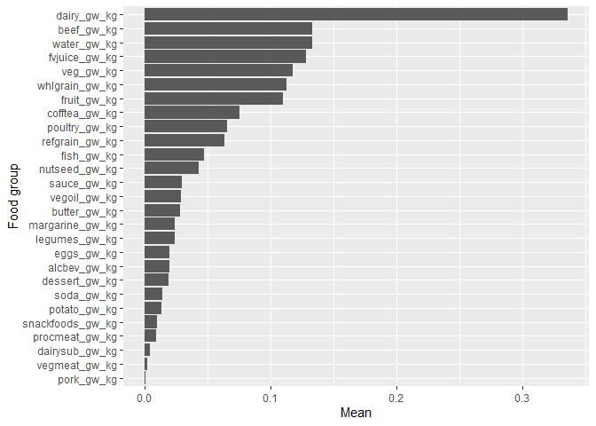
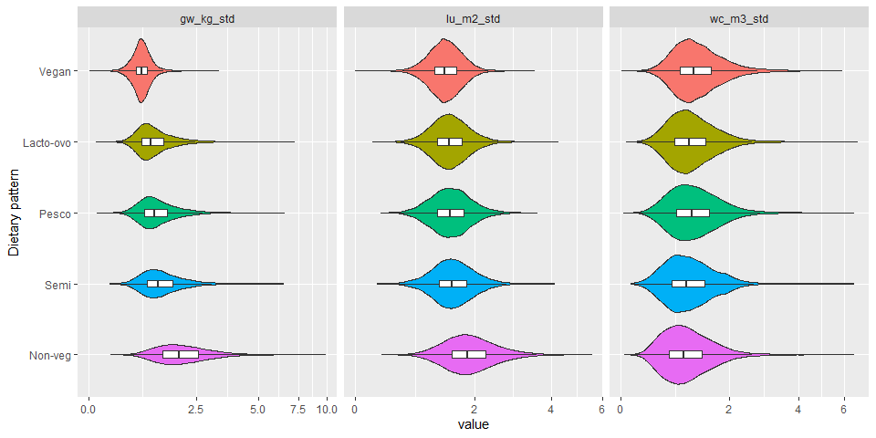

AHS-2 Environmental Nutrition
================

## Dataset

-   File path:
    `M:\Groups\Nutrition\Environmental Nutrition\AHS-2 Environment and Health`

-   File Name: `baseline-environmental-data-per-subject-20210824.csv`

-   Includes *n* = 88008 subjects and

-   187 variables:

    -   Demographics:
        -   Age at baseline: `agein`
        -   BMI: `bmi`
        -   Education, 3 levels: `edu3cat`
        -   Gender: `female`
        -   Race (Black/Non-Black): `black`
    -   Total intake in kcal, gram and servings per day
    -   28 food groups in:
        -   kcal/day: `*_kcal`
        -   gram/day: `*_gram`
        -   standard servings/day: `*_srv`
        -   GWP (kg CO2-eq): `*_gw_kg`
        -   land use (m²a): `*_lu_m2`
        -   water consumption (m³): `*_wc_m3`
        -   (replace \* with food group name – see below)

-   There are 28 food groups:

<!-- -->

    ##  [1] "fruit"      "fvjuice"    "veg"        "potato"     "legumes"   
    ##  [6] "refgrain"   "whlgrain"   "vegmeat"    "nutseed"    "sauce"     
    ## [11] "vegoil"     "eggs"       "dairy"      "dairysub"   "margarine" 
    ## [16] "butter"     "beef"       "procmeat"   "poultry"    "pork"      
    ## [21] "fish"       "water"      "soda"       "cofftea"    "alcbev"    
    ## [26] "dessert"    "snackfoods"

### Issues

-   Environmental variables of cereal (`cereal_gw_kg`, `cereal_lu_m2`,
    `cereal_wc_m3`) have all zero values. AM has been notified.

### Changes

-   More subjects (+12,000) included.
-   Dietary pattern (5 groups) added.
-   `pork` and `beef` intakes are now separated.
-   All food group variables (`*_kcal`, `*_gram`, `*_srv`, `*_gw_kg`,
    `*_lu_m2`, `*_wc_m3`) were winsorized at the 99.9th percentile of
    each variable. Total `kcal`, `gram`, `srv`, `gw_kg`, `lu_m2`, and
    `wc_m3` were recalculated by summing across 28 food groups after
    winsorization.
-   Environmental impact variables (`*_gw_kg`, `*_lu_m2`, `*_wc_m3`)
    were standardized to 2000 kcal/day. This was done as follows:
    non-zero values of each environmental variable were log-transformed
    (due to skewness) and then regressed on the total energy. Residuals
    from the regression were added by predicted values for 2000 kcal and
    then back-transformed to the original unit. Zero values remained
    zero in this process.

## Demographics

    ##                    
    ##                     level          Overall      
    ##   n                                88008        
    ##   agein (mean (SD))                58.32 (14.31)
    ##   bmi (mean (SD))                  27.11 (5.84) 
    ##   edu3cat (%)       Highschool     18627 (21.4) 
    ##                     Some College   34350 (39.5) 
    ##                     College Degree 33914 (39.0) 
    ##   female (%)        Male           30921 (35.1) 
    ##                     Female         57057 (64.9) 
    ##   black (%)         Non-Black      65354 (74.7) 
    ##                     Black          22175 (25.3) 
    ##   vegstat (%)       Vegan           7351 ( 8.4) 
    ##                     Lacto-ovo      26412 (30.0) 
    ##                     Pesco           8655 ( 9.8) 
    ##                     Semi            4772 ( 5.4) 
    ##                     Non-veg        40817 (46.4)

## Total food intake

-   Distributions of total intake in kcal, gram and servings per day
    -   It appears that those with kcal &lt;500 or &gt;4500 are already
        excluded.
    -   The max gram intake became more reasonable after winsorizing
        data.

<!-- -->

    ##         min      Q1  median      Q3     max    mean      sd skew
    ## kcal 140.75 1195.34 1591.82 2089.16 4440.27 1697.58  690.42 0.80
    ## gram  88.99 2147.52 2754.31 3434.03 9762.23 2838.34 1029.28 0.62
    ## srv    1.48   30.38   39.05   49.21  127.34   40.65   14.58 0.65

## Total environmental impact

-   Distributions of total GWP, land use and water consumption are
    right-skewed:

<!-- -->

    ##        min   Q1 median   Q3   max mean   sd skew
    ## gw_kg 0.01 0.97   1.38 2.00 10.11 1.61 0.93 1.79
    ## lu_m2 0.00 1.04   1.43 1.96  7.81 1.58 0.76 1.24
    ## wc_m3 0.01 0.67   0.99 1.39  7.04 1.12 0.66 1.87

<!-- -->

## Mean plots of environmental impact by food group

-   Mean GWP by food group: The consumption of `dairy` contributes to
    the largest GWP, followed by `beef` and `water`, among 28 food
    groups.

-   Mean land use by food group: `dairy` followed by `veg`, `legumes`
    and `whlgrain`.

-   Mean water consumption by food group: `fvjuice`, followed by `veg`
    and `fruit`.

## Comparisons of environmental impact by dietary pattern

-   Total energy-adjusted GWP (`gw_kg_std`), land use (`lu_m2_std`), and
    water consumption (`wc_m3_std`) by dietary pattern are shown in
    violin plots below. Note that the horizontal axis is on the
    pseudo-log scale.
-   GWP and land use increase in the order of vegan &lt; lacto-ovo &lt;
    pesco &lt; semi &lt; non-veg.
    -   The total GWP of non-vegetarians is almost twice as high as that
        of vegans.
-   For water consumption, vegans have the highest usage: vegan &gt;
    pesco &gt; lacto-ovo &gt; semi &gt; non-veg.

<!-- -->

    ## # A tibble: 15 x 5
    ## # Groups:   variable [3]
    ##    variable  vegstat   Median  Mean    SD
    ##    <fct>     <fct>      <dbl> <dbl> <dbl>
    ##  1 gw_kg_std Vegan       1.06  1.07 0.224
    ##  2 gw_kg_std Lacto-ovo   1.27  1.38 0.500
    ##  3 gw_kg_std Pesco       1.35  1.46 0.525
    ##  4 gw_kg_std Semi        1.45  1.57 0.597
    ##  5 gw_kg_std Non-veg     1.98  2.14 0.824
    ##  6 lu_m2_std Vegan       1.42  1.43 0.309
    ##  7 lu_m2_std Lacto-ovo   1.49  1.52 0.364
    ##  8 lu_m2_std Pesco       1.51  1.54 0.385
    ##  9 lu_m2_std Semi        1.55  1.58 0.411
    ## 10 lu_m2_std Non-veg     1.85  1.92 0.561
    ## 11 wc_m3_std Vegan       1.26  1.36 0.537
    ## 12 wc_m3_std Lacto-ovo   1.16  1.25 0.502
    ## 13 wc_m3_std Pesco       1.21  1.30 0.549
    ## 14 wc_m3_std Semi        1.12  1.21 0.551
    ## 15 wc_m3_std Non-veg     1.07  1.16 0.524
