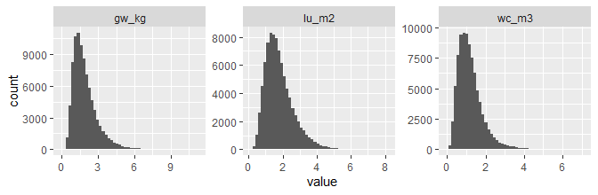
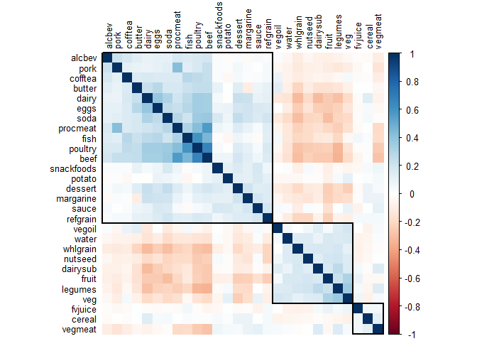

AHS-2 Environmental Nutrition
================

## Dataset

-   File path:
    `M:\Groups\Nutrition\Environmental Nutrition\AHS-2 Environment and Health`

-   File Name: `baseline-environmental-data-per-subject-20210912.csv`

-   Includes *n* = 88008 subjects and

-   190 variables:

    -   `analysisid`
    -   Demographics:
        -   Age at baseline: `agein`
        -   BMI: `bmi`
        -   Education, 3 levels: `edu3cat`
        -   Gender: `female`
        -   Race (Black/Non-Black): `black`
    -   Total intake in kcal, gram and servings per day
    -   28 food groups in:
        -   kcal/day: `*_kcal`
        -   gram/day: `*_gram`
        -   standard servings/day: `*_srv`
        -   GWP (kg CO2-eq): `*_gw_kg`
        -   land use (m²a): `*_lu_m2`
        -   water consumption (m³): `*_wc_m3`
        -   (replace \* with food group name – see below)

-   There are 28 food groups:

<!-- -->

    ##  [1] "cereal"     "snackfoods" "dessert"    "alcbev"     "cofftea"   
    ##  [6] "soda"       "water"      "fish"       "pork"       "poultry"   
    ## [11] "procmeat"   "beef"       "butter"     "margarine"  "dairysub"  
    ## [16] "dairy"      "eggs"       "vegoil"     "sauce"      "nutseed"   
    ## [21] "vegmeat"    "whlgrain"   "refgrain"   "legumes"    "potato"    
    ## [26] "veg"        "fvjuice"    "fruit"

### Issues

-   Add an exclsion criterion on kcal after winzorization?
-   Change units of environmental variables

### Changes

-   More subjects (+12,000) included.
-   Dietary pattern (5 groups) added.
-   `pork` and `beef` intakes are now separated.
-   All food group variables (`*_kcal`, `*_gram`, `*_srv`, `*_gw_kg`,
    `*_lu_m2`, `*_wc_m3`) were winsorized at the 99.9th percentile of
    each variable. Total `kcal`, `gram`, `srv`, `gw_kg`, `lu_m2`, and
    `wc_m3` were recalculated by summing across 28 food groups after
    winsorization.
-   Environmental impact variables (`*_gw_kg`, `*_lu_m2`, `*_wc_m3`)
    were standardized to 2000 kcal/day. This was done as follows:
    non-zero values of each environmental variable were log-transformed
    (due to skewness) and then regressed on the total energy. Residuals
    from the regression were added by predicted values for 2000 kcal and
    then back-transformed to the original unit. Zero values remained
    zero in this process.

## Demographics

|                   | level          | Overall       |
|:------------------|:---------------|:--------------|
| n                 |                | 88008         |
| agein (mean (SD)) |                | 58.32 (14.31) |
| bmi (mean (SD))   |                | 27.11 (5.84)  |
| edu3cat (%)       | Highschool     | 18627 (21.4)  |
|                   | Some College   | 34350 (39.5)  |
|                   | College Degree | 33914 (39.0)  |
| female (%)        | Male           | 30921 (35.1)  |
|                   | Female         | 57057 (64.9)  |
| black (%)         | Non-Black      | 65354 (74.7)  |
|                   | Black          | 22175 (25.3)  |
| vegstat (%)       | Vegan          | 7351 ( 8.4)   |
|                   | Lacto-ovo      | 26412 (30.0)  |
|                   | Pesco          | 8655 ( 9.8)   |
|                   | Semi           | 4772 ( 5.4)   |
|                   | Non-veg        | 40817 (46.4)  |

## Total food intake

-   Distributions of total intake in kcal, gram and servings per day
    -   In the original data, those with kcal &lt;500 or &gt;4500 were
        already excluded. The total intake shown below was re-calculated
        by summing up all winsorized food group intakes.
    -   The max gram intake became more reasonable after winsorizing
        data.

|      |    min |   Q0.25 |  median |   Q0.75 |     max |    mean |      sd | skew |
|:-----|-------:|--------:|--------:|--------:|--------:|--------:|--------:|-----:|
| kcal | 140.75 | 1234.70 | 1640.30 | 2145.19 | 4474.44 | 1746.07 |  703.61 | 0.80 |
| gram | 200.09 | 2160.76 | 2768.07 | 3448.33 | 9782.78 | 2851.89 | 1031.10 | 0.62 |
| srv  |   1.48 |   30.87 |   39.56 |   49.80 |  129.16 |   41.17 |   14.66 | 0.65 |

## Total environmental impact

-   Distributions of total GWP, land use and water consumption are
    right-skewed:

|        |  min | Q0.25 | median | Q0.75 |   max | mean |   sd | skew |
|:-------|-----:|------:|-------:|------:|------:|-----:|-----:|-----:|
| gw\_kg | 0.06 |  1.21 |   1.69 |  2.38 | 11.28 | 1.93 | 1.02 | 1.61 |
| lu\_m2 | 0.12 |  1.21 |   1.65 |  2.23 |  8.08 | 1.81 | 0.83 | 1.16 |
| wc\_m3 | 0.02 |  0.75 |   1.08 |  1.50 |  7.07 | 1.21 | 0.68 | 1.77 |

<!-- -->

## Distribution of environmental impact by food group

-   GWP

<!-- -->

    ##                  min Q0.25 median Q0.75   max  mean    sd   skew
    ## cereal_gw_kg       0 0.000  0.008 0.022 0.254 0.017 0.026  3.267
    ## snackfoods_gw_kg   0 0.000  0.001 0.011 0.246 0.010 0.023  4.923
    ## dessert_gw_kg      0 0.005  0.026 0.049 0.811 0.045 0.070  4.449
    ## alcbev_gw_kg       0 0.000  0.000 0.000 4.000 0.020 0.189 15.322
    ## cofftea_gw_kg      0 0.000  0.001 0.027 1.873 0.075 0.192  4.115
    ## soda_gw_kg         0 0.000  0.001 0.011 0.384 0.014 0.034  5.030
    ## water_gw_kg        0 0.072  0.129 0.187 0.280 0.133 0.075  0.060
    ## fish_gw_kg         0 0.000  0.014 0.076 1.070 0.058 0.113  4.002
    ## pork_gw_kg         0 0.000  0.000 0.000 0.093 0.001 0.005 13.088
    ## poultry_gw_kg      0 0.000  0.000 0.076 1.323 0.066 0.123  3.380
    ## procmeat_gw_kg     0 0.000  0.000 0.000 0.442 0.009 0.036  6.585
    ## beef_gw_kg         0 0.000  0.000 0.133 2.773 0.133 0.308  3.787
    ## butter_gw_kg       0 0.000  0.000 0.017 0.702 0.028 0.071  4.906
    ## margarine_gw_kg    0 0.001  0.011 0.033 0.313 0.024 0.035  3.195
    ## dairysub_gw_kg     0 0.000  0.000 0.004 0.417 0.007 0.027  9.158
    ## dairy_gw_kg        0 0.070  0.262 0.592 5.089 0.434 0.546  2.928
    ## eggs_gw_kg         0 0.000  0.009 0.037 0.322 0.020 0.032  4.678
    ## vegoil_gw_kg       0 0.007  0.018 0.039 0.335 0.030 0.036  3.093
    ## sauce_gw_kg        0 0.015  0.032 0.060 0.794 0.047 0.060  5.570
    ## nutseed_gw_kg      0 0.012  0.026 0.057 0.542 0.043 0.051  3.477
    ## vegmeat_gw_kg      0 0.008  0.047 0.097 0.998 0.072 0.095  3.521
    ## whlgrain_gw_kg     0 0.053  0.102 0.173 1.207 0.146 0.149  2.140
    ## refgrain_gw_kg     0 0.032  0.065 0.112 0.857 0.089 0.093  2.905
    ## legumes_gw_kg      0 0.010  0.022 0.047 0.345 0.035 0.040  2.869
    ## potato_gw_kg       0 0.005  0.011 0.018 0.116 0.015 0.014  2.510
    ## veg_gw_kg          0 0.060  0.100 0.155 0.664 0.118 0.083  1.786
    ## fvjuice_gw_kg      0 0.020  0.058 0.168 1.717 0.128 0.180  3.343
    ## fruit_gw_kg        0 0.046  0.084 0.139 1.001 0.110 0.103  3.012

-   Land use

<!-- -->

    ##                  min Q0.25 median Q0.75   max  mean    sd   skew
    ## cereal_lu_m2       0 0.000  0.014 0.042 0.494 0.033 0.052  3.252
    ## snackfoods_lu_m2   0 0.000  0.001 0.009 0.181 0.008 0.017  4.856
    ## dessert_lu_m2      0 0.007  0.023 0.045 0.680 0.040 0.061  4.236
    ## alcbev_lu_m2       0 0.000  0.000 0.000 0.800 0.004 0.038 15.322
    ## cofftea_lu_m2      0 0.000  0.001 0.018 1.192 0.048 0.121  4.118
    ## soda_lu_m2         0 0.000  0.001 0.012 0.398 0.014 0.035  5.030
    ## water_lu_m2        0 0.003  0.005 0.007 0.011 0.005 0.003  0.060
    ## fish_lu_m2         0 0.000  0.002 0.011 0.135 0.008 0.014  3.779
    ## pork_lu_m2         0 0.000  0.000 0.000 0.131 0.001 0.007 13.088
    ## poultry_lu_m2      0 0.000  0.000 0.058 1.010 0.050 0.094  3.381
    ## procmeat_lu_m2     0 0.000  0.000 0.000 0.393 0.009 0.033  6.478
    ## beef_lu_m2         0 0.000  0.000 0.119 2.484 0.119 0.275  3.789
    ## butter_lu_m2       0 0.000  0.000 0.012 0.483 0.019 0.049  4.906
    ## margarine_lu_m2    0 0.000  0.003 0.008 0.078 0.006 0.009  3.195
    ## dairysub_lu_m2     0 0.000  0.000 0.001 0.232 0.004 0.015  9.514
    ## dairy_lu_m2        0 0.043  0.170 0.387 2.871 0.276 0.334  2.564
    ## eggs_lu_m2         0 0.000  0.006 0.027 0.239 0.015 0.024  4.678
    ## vegoil_lu_m2       0 0.016  0.041 0.093 0.833 0.070 0.089  3.158
    ## sauce_lu_m2        0 0.011  0.022 0.042 0.203 0.030 0.027  1.754
    ## nutseed_lu_m2      0 0.022  0.050 0.112 1.152 0.086 0.109  3.724
    ## vegmeat_lu_m2      0 0.005  0.022 0.047 0.491 0.035 0.047  3.559
    ## whlgrain_lu_m2     0 0.058  0.117 0.228 1.112 0.164 0.152  1.826
    ## refgrain_lu_m2     0 0.057  0.106 0.187 1.020 0.141 0.127  2.204
    ## legumes_lu_m2      0 0.062  0.127 0.241 1.660 0.184 0.189  2.569
    ## potato_lu_m2       0 0.007  0.012 0.020 0.124 0.016 0.015  2.424
    ## veg_lu_m2          0 0.107  0.176 0.284 1.262 0.217 0.158  1.850
    ## fvjuice_lu_m2      0 0.014  0.050 0.146 1.457 0.104 0.143  3.415
    ## fruit_lu_m2        0 0.042  0.076 0.127 0.842 0.099 0.091  2.768

-   Water consumption

<!-- -->

    ##                  min Q0.25 median Q0.75   max  mean    sd   skew
    ## cereal_wc_m3       0 0.000  0.003 0.010 0.110 0.008 0.012  3.213
    ## snackfoods_wc_m3   0 0.000  0.002 0.004 0.066 0.004 0.006  4.141
    ## dessert_wc_m3      0 0.002  0.009 0.018 0.289 0.016 0.025  4.409
    ## alcbev_wc_m3       0 0.000  0.000 0.000 0.413 0.002 0.019 15.322
    ## cofftea_wc_m3      0 0.000  0.000 0.004 0.061 0.004 0.007  3.475
    ## soda_wc_m3         0 0.000  0.005 0.038 1.288 0.047 0.114  5.030
    ## water_wc_m3        0 0.002  0.003 0.004 0.006 0.003 0.002  0.060
    ## fish_wc_m3         0 0.000  0.001 0.011 0.140 0.007 0.015  4.093
    ## pork_wc_m3         0 0.000  0.000 0.000 0.006 0.000 0.000 13.088
    ## poultry_wc_m3      0 0.000  0.000 0.000 0.008 0.000 0.001  3.286
    ## procmeat_wc_m3     0 0.000  0.000 0.000 0.008 0.000 0.001  7.625
    ## beef_wc_m3         0 0.000  0.000 0.002 0.033 0.002 0.004  3.789
    ## butter_wc_m3       0 0.000  0.000 0.000 0.012 0.000 0.001  4.906
    ## margarine_wc_m3    0 0.001  0.009 0.026 0.250 0.019 0.028  3.195
    ## dairysub_wc_m3     0 0.000  0.000 0.000 0.072 0.001 0.005  8.181
    ## dairy_wc_m3        0 0.003  0.009 0.021 0.405 0.020 0.034  5.017
    ## eggs_wc_m3         0 0.000  0.001 0.003 0.027 0.002 0.003  4.678
    ## vegoil_wc_m3       0 0.000  0.001 0.003 0.031 0.002 0.003  3.312
    ## sauce_wc_m3        0 0.012  0.023 0.044 0.603 0.038 0.049  4.865
    ## nutseed_wc_m3      0 0.023  0.051 0.110 1.063 0.083 0.101  3.593
    ## vegmeat_wc_m3      0 0.001  0.017 0.038 0.431 0.028 0.039  3.840
    ## whlgrain_wc_m3     0 0.028  0.057 0.106 0.632 0.082 0.082  2.022
    ## refgrain_wc_m3     0 0.005  0.018 0.032 0.310 0.027 0.035  3.576
    ## legumes_wc_m3      0 0.005  0.010 0.019 0.154 0.015 0.016  2.894
    ## potato_wc_m3       0 0.006  0.011 0.021 0.108 0.015 0.014  1.918
    ## veg_wc_m3          0 0.130  0.219 0.353 1.685 0.268 0.200  1.971
    ## fvjuice_wc_m3      0 0.047  0.138 0.418 4.122 0.306 0.433  3.307
    ## fruit_wc_m3        0 0.079  0.157 0.275 2.002 0.215 0.214  2.923

## Mean plots of environmental impact by food group

-   Mean GWP by food group: The consumption of `dairy` contributes to
    the largest GWP, followed by `whlgrain` and `beef`, among 28 food
    groups.

-   Mean land use by food group: `dairy` followed by `veg`, `legumes`
    and `whlgrain`.

-   Mean water consumption by food group: `fvjuice`, followed by `veg`
    and `fruit`.

## Comparisons of environmental impact by dietary pattern

-   Total energy-adjusted GWP (`gw_kg_std`), land use (`lu_m2_std`), and
    water consumption (`wc_m3_std`) by dietary pattern are shown in
    violin plots below. Note that the horizontal axis is on the
    pseudo-log scale.
-   GWP and land use increase in the order of vegan &lt; lacto-ovo &lt;
    pesco &lt; semi &lt; non-veg.
    -   The average total GWP of non-vegetarians is almost twice as high
        as that of vegans.
-   For water consumption, vegans have the highest usage: vegan &gt;
    pesco &gt; lacto-ovo &gt; semi &gt; non-veg.

<!-- -->

    ## # A tibble: 15 x 5
    ## # Groups:   variable [3]
    ##    variable  vegstat   Median  Mean    SD
    ##    <fct>     <fct>      <dbl> <dbl> <dbl>
    ##  1 gw_kg_std Vegan       1.28  1.29  0.25
    ##  2 gw_kg_std Lacto-ovo   1.58  1.69  0.53
    ##  3 gw_kg_std Pesco       1.66  1.76  0.54
    ##  4 gw_kg_std Semi        1.76  1.87  0.61
    ##  5 gw_kg_std Non-veg     2.29  2.44  0.82
    ##  6 lu_m2_std Vegan       1.58  1.58  0.3 
    ##  7 lu_m2_std Lacto-ovo   1.7   1.73  0.36
    ##  8 lu_m2_std Pesco       1.71  1.73  0.37
    ##  9 lu_m2_std Semi        1.76  1.78  0.41
    ## 10 lu_m2_std Non-veg     2.05  2.13  0.55
    ## 11 wc_m3_std Vegan       1.34  1.44  0.53
    ## 12 wc_m3_std Lacto-ovo   1.24  1.32  0.49
    ## 13 wc_m3_std Pesco       1.28  1.36  0.53
    ## 14 wc_m3_std Semi        1.19  1.28  0.53
    ## 15 wc_m3_std Non-veg     1.14  1.22  0.51

-   In all three variables, differences across dietary patterns were
    highly significant:

| Variable    | method                       | statistic | p.value       |
|:------------|:-----------------------------|----------:|:--------------|
| gw\_kg\_std | Kruskal-Wallis rank sum test | 30913.876 | &lt; 2.22e-16 |
| lu\_m2\_std | Kruskal-Wallis rank sum test | 15764.787 | &lt; 2.22e-16 |
| wc\_m3\_std | Kruskal-Wallis rank sum test |  2208.113 | &lt; 2.22e-16 |

## Correlation heatmap of food group intake

-   Correlation heat maps were generated among 28 food groups in terms
    of gram (standardized to 2000 kcal), based on Spearman correlation.
    The order of food group variables were determined by the
    average-linkage hierarchical clustering.

-   Moderately high correlations were found between beef and poultry
    (*r* = 0.66), between poultry and fish (*r* = 0.60), and between
    beef and processed meat (*r* = 0.57). Notice the groupings of
    positively correlated foods (3 groupings were chosen from the
    cluster analysis).

<!-- -->

## Models for env variables on food group intakes

-   A linear model was fitted for GWP, regressed on all 28 food group
    intakes (standardized to 2000 kcal). The unit of GWP was changed to
    g CO2-eq to make beta coefficients larger. Estimated beta
    coefficients (and their 95% CI) were plotted from the largest to the
    smallest.

<!-- -->

| term       | estimate | conf.low | conf.high |
|:-----------|---------:|---------:|----------:|
| beef       |    19.03 |    18.88 |     19.19 |
| procmeat   |    15.73 |    14.64 |     16.82 |
| butter     |    10.65 |    10.32 |     10.98 |
| poultry    |     6.16 |     6.05 |      6.28 |
| fish       |     4.95 |     4.84 |      5.06 |
| alcbev     |     4.93 |     4.88 |      4.98 |
| snackfoods |     2.64 |     2.28 |      3.00 |
| sauce      |     2.11 |     2.03 |      2.20 |
| dairy      |     1.91 |     1.90 |      1.92 |
| eggs       |     1.88 |     1.76 |      2.01 |
| vegmeat    |     1.45 |     1.40 |      1.49 |
| dessert    |     1.31 |     1.23 |      1.39 |
| margarine  |     1.23 |     1.05 |      1.41 |
| cofftea    |     0.77 |     0.76 |      0.77 |
| fvjuice    |     0.61 |     0.60 |      0.62 |
| dairysub   |     0.40 |     0.36 |      0.44 |
| nutseed    |     0.34 |     0.24 |      0.45 |
| veg        |     0.28 |     0.27 |      0.29 |
| potato     |     0.15 |     0.09 |      0.21 |
| whlgrain   |     0.15 |     0.13 |      0.16 |
| water      |     0.13 |     0.12 |      0.13 |
| fruit      |     0.10 |     0.09 |      0.11 |
| refgrain   |     0.08 |     0.06 |      0.11 |
| soda       |     0.08 |     0.07 |      0.09 |
| legumes    |     0.02 |     0.00 |      0.05 |
| vegoil     |    -0.37 |    -0.56 |     -0.19 |
| cereal     |    -0.52 |    -0.62 |     -0.41 |
| pork       |   -10.90 |   -12.74 |     -9.06 |

-   The model fit was poor, as expected from the distribution of GWP.
    Model assumptions were clearly violated.

<!-- -->

-   Instead of assuming normal errors, we used:
    -   the generalized gamma (GG) model
    -   the generalized beta of the second kind (GB2) model
-   A worm plot ([van Buuren & Fredriks,
    2001](https://pubmed.ncbi.nlm.nih.gov/11304741/)) was generated for
    each model to compare model fits.
    -   Compared to the normal model, the GG model fits better, having a
        smaller AIC. However, its worm plot still indicates a poor fit.
    -   The model fit further improved in the GB2 model. Its worm plot
        is more acceptable, compared to the other two models.

<!-- -->

